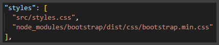
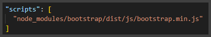

# Advanced-Web-Applications-Engineering-Class-Project

Activity Project for Advanced Web Applications Engineering class in 2023/2024 winter semester at Cracow Uniwersity Of Technology part-time Computer Science studies

## Overview

Application name: **SWIMS - Simple Web Inventory Management System**

## Repository

According to the guidelines provided by the teacher both backend and frontend projects are stored in single repository.

Repository URL: [GitHub/Tomasz-Zdeb/Advanced-Web-Applications-Engineering-Class-Project](https://github.com/Tomasz-Zdeb/Advanced-Web-Applications-Engineering-Class-Project)

## Swagger UI

**SWIMS** supports both Swagger and Swagger UI.

Default routes are:

- [/api/v3/api-docs](http://localhost:8080/v3/api-docs)
- [/api/swagger-ui/index.html#/](http://localhost:8080/swagger-ui/index.html#/)


## Frontend

#### Development Server

```bash
npm run start
```
Remember to first install all the dependencies:

```bash
npm install
```

#### Initialization

```powershell
ng new swims --routing --skip-git --skip-tests --style css
```

#### Adding Bootstrap

- Install bootstrap in the project by issuing command: `npm install bootstrap`
- add **bootstrap css reference** to `angular.json` config file
<div style="text-align: center;">
    
</div>

- add **bootstrap js reference** to `angular.json` config file

<div style="text-align: center;">
    
</div>

#### Frontend References

* [Angular Docs: ng new](https://angular.io/cli/new)

## Backend

### API - Spring Boot App

#### Initialization

<div style="text-align: center;">
    
</div>


### Database - PostgreSQL

#### Docker Image Build

```bash
docker build -t swims-db-posgres .
```

## References

* [Spring Postgres Example](https://www.bezkoder.com/spring-boot-postgresql-example/)

* [IntelliJ Set Up GPG Key](https://www.jetbrains.com/help/idea/2022.3/set-up-GPG-commit-signing.html#configure-the-environment)

* [Add GPG Key to You GitHub Account](https://docs.github.com/en/authentication/managing-commit-signature-verification/adding-a-gpg-key-to-your-github-account)

* [Generating A New GPG Key](https://docs.github.com/en/authentication/managing-commit-signature-verification/generating-a-new-gpg-key)

* [Spring REST OpenApi Documentation](https://www.baeldung.com/spring-rest-openapi-documentation)

* [Spring Request Mapping](https://docs.spring.io/spring-framework/reference/web/webmvc/mvc-controller/ann-requestmapping.html)

* [JPA Topic](https://www.baeldung.com/category/persistence/jpa)

* [JPA Many To Many](https://www.baeldung.com/jpa-many-to-many)