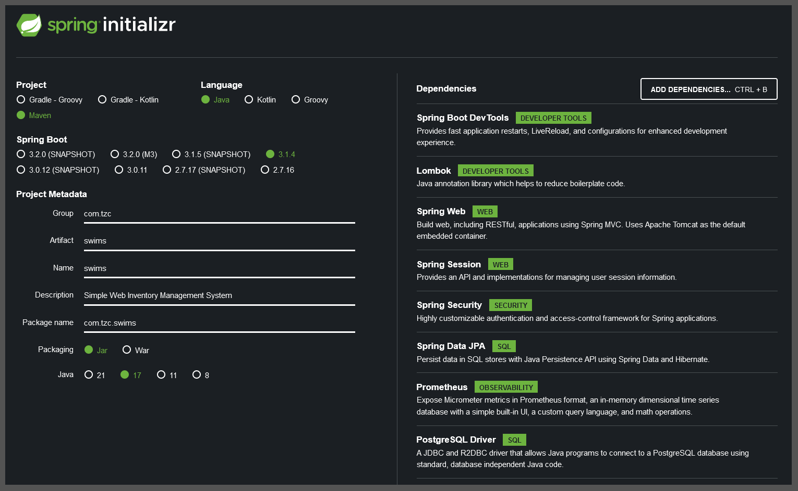

# Advanced-Web-Applications-Engineering-Class-Project

Activity Project for Advanced Web Applications Engineering class in 2023/2024 winter semester at Cracow Uniwersity Of Technology part-time Computer Science studies

## Overview

Application name: **SWIMS - Simple Web Inventory Management System**

## Repository

According to the guidelines provided by the teacher both backend and frontend projects are stored in single repository.

Repository URL: [GitHub/Tomasz-Zdeb/Advanced-Web-Applications-Engineering-Class-Project](https://github.com/Tomasz-Zdeb/Advanced-Web-Applications-Engineering-Class-Project)

## Swagger UI

**SWIMS** supports both Swagger and Swagger UI.

Default routes are:

- [/v3/api-docs](http://localhost:8080/v3/api-docs)
- [/swagger-ui/index.html#/](http://localhost:8080/swagger-ui/index.html#/)


## Initialization

### Frontend (Angular)

```powershell
ng new swims --routing --skip-git --skip-tests --style css
```

* [Angular Docs: ng new](https://angular.io/cli/new)

### Backend (API - Spring Boot)



## Additonal References

* [IntelliJ Set Up GPG Key](https://www.jetbrains.com/help/idea/2022.3/set-up-GPG-commit-signing.html#configure-the-environment)

* [Add GPG Key to You GitHub Account](https://docs.github.com/en/authentication/managing-commit-signature-verification/adding-a-gpg-key-to-your-github-account)

* [Generating A New GPG Key](https://docs.github.com/en/authentication/managing-commit-signature-verification/generating-a-new-gpg-key)

* [Spring REST OpenApi Documentation](https://www.baeldung.com/spring-rest-openapi-documentation)

## Project Sprint Schedule

<center>

| Sprint    | End Date   | Active Tasks | Finished Tasks
|-----------|------------|--------------|---------------
| Sprint 1  | 2023-10-09 | 8            |7
| Sprint 2  | 2023-10-16 | 1            |0
| Sprint 3  | 2023-10-23 | 1            |
| Sprint 4  | 2023-10-30 |
| Sprint 5  | 2023-11-06 |
| Sprint 6  | 2023-11-13 |
| Sprint 7  | 2023-11-20 |
| Sprint 8  | 2023-11-27 |
| Sprint 9  | 2023-12-04 |
| Sprint 10 | 2023-12-11 |
| Sprint 11 | 2023-12-18 |
| Sprint 12 | 2023-12-25 |
| Sprint 13 | 2024-01-01 |
| Sprint 14 | 2024-01-08 |
| Sprint 15 | 2024-01-15 |
| Sprint 16 | 2024-01-22 |
| Sprint 17 | 2024-01-29 |
| Sprint 18 | 2024-02-05 |
| Sprint 19 | 2024-02-12 |
| Sprint 20 | 2024-02-19 |
| Sprint 21 | 2024-02-26 |
| Sprint 22 | 2024-03-04 |
| Sprint 23 | 2024-03-11 |

</center>
